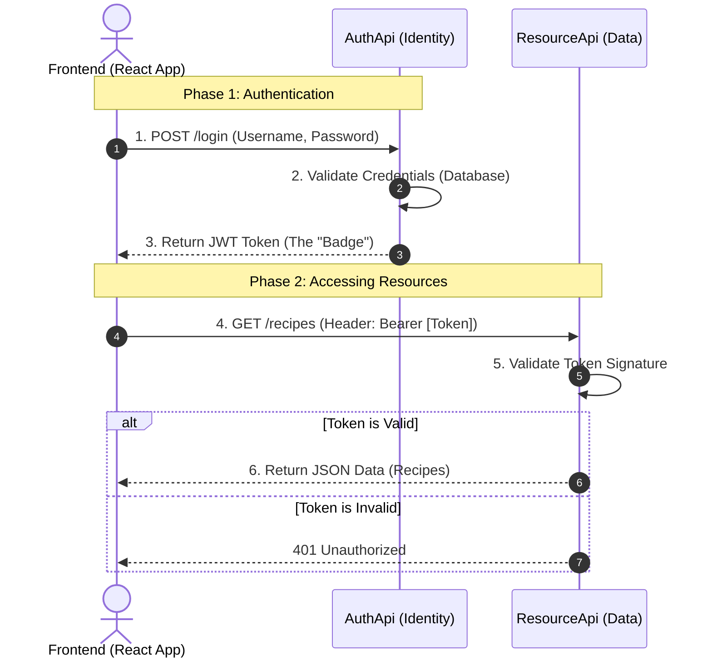

# Student Training Manual: Building a Secure Web API System

> [!IMPORTANT]
> **Industry-Based Learning**: This is an accelerated, industry-focused module. We move fast and use professional tools. We do not "reinvent the wheel"—instead, we use robust, community-standard libraries (NuGet packages) to build secure and scalable systems efficiently. This is how software is built in the real world.

This manual guides you through building a complete authentication and resource system using **ASP.NET Core (Web API)**, **Entity Framework Core (SQLite)**, and **JWT (JSON Web Tokens)**.

---

## 1. Project Overview & Architecture

We are building a **Microservices-style** architecture where Authentication is separated from Data Resources.

### **The Big Picture**

*   **Users** (Frontend) need to log in.
*   **AuthApi** checks their password and gives them a "Badge" (JWT Token).
*   **ResourceApi** guards the data (Recipes). It only lets people in if they show a valid Badge.

#### **Architecture Sequence Diagram**


---

## 2. Tools & Prerequisites

*   **.NET SDK**: Version 8, 9, or 10. (Run `dotnet --version` to check).
*   **Editor**: Visual Studio Code (VS Code) or Visual Studio.
*   **API Client**: Postman or ThunderClient (VS Code Extension).

---

## 3. General Concepts

### **Why use NuGet Packages?**
*   **Don't Reinvent the Wheel**: Authentication, Database management, and Cryptography are hard to get right. We use **NuGet Packages** (libraries created by Microsoft and experts) to handle this.
*   **Example**: Instead of writing raw SQL queries or hashing passwords manually, we use **Entity Framework Core** and **ASP.NET Core Identity**.

### **What is `UserManager`?**
*   **The Guard**: `UserManager<IdentityUser>` is a service from the **Microsoft.AspNetCore.Identity** library.
*   **Where it comes from**: We installed it via the NuGet package `Microsoft.AspNetCore.Identity.EntityFrameworkCore`.
*   **How to access it**: We use **Dependency Injection**. We ask for it in the Controller's constructor (see `AuthController.cs`), and ASP.NET Core gives it to us automatically.
*   **Key Features**:
    1.  `CreateAsync(user, password)`: Creates a new user and **hashes the password** (never store plain text!).
    2.  `CheckPasswordAsync(user, "password123")`: securely verifies a login attempt.
    3.  `FindByNameAsync("username")`: Looks up a user in the database.
*   **Why we use it**: It handles specialized security logic that takes experts years to perfect. By using it, we ensure our system is secure by industry standards.

### **Deep Dive: Database Concepts**
*   **`DbContext`**: The "Manager". It matches your code to the database. It handles opening connections, saving data, and querying.
*   **`IdentityDbContext`**: A specialized `DbContext` from Microsoft that comes **pre-loaded** with tables for Users, Roles, and Logins.
    *   *Analogy*: `DbContext` is an empty notebook. `IdentityDbContext` is a notebook that already has pages printed for "User Names" and "Passwords".
*   **`DbSet<Recipe>`**: Represents a specific **Table** in the database.
    *   `DbSet<Recipe> Recipes`: "This application allows us to access the 'Recipes' table".
*   **`OnModelCreating`**: The "Configuration" method.
    *   It runs **once** when the app starts.
    *   We use it to tell the database extra rules (e.g., "Seed this initial data").
*   **`override`**: This keyword means "Don't use the default behavior; use MY version instead." We override `OnModelCreating` to add our custom seed data.
*   **Constructor (`ctor`)**: The startup method for a class. We use it to receive the `DbContextOptions` (connection strings) which we pass to the base class.

### **Deep Dive: API & Security Concepts**
*   **DTO (Data Transfer Object)**:
    *   *What*: A simple class used *only* to send data over the network (JSON).
    *   *Why*: We don't send the `User` entity because it contains the password hash! We create a `UserDto` or `LoginRequest` to send only safe data.
*   **`[FromBody]` attribute**:
    *   Tells ASP.NET Core: "Look for this data inside the **Solution Body** (JSON), not in the URL."
    *   Used for larger or sensitive data like passwords.
*   **Why POST for Login? (vs GET or Query String)**:
    *   **GET/Query String**: puts data in the URL (e.g., `login?password=secret`). This is bad because URLs are saved in browser history and server logs. Everyone can see your password!
    *   **POST**: Puts data inside the Request Body. It is not shown in the URL or history.
*   **Why Token (JWT) vs Basic Auth?**:
    *   **Basic Auth**: Sends "username:password" with *every single click*. If you click 100 times, you send your secret password 100 times.
    *   **Token (JWT)**: You send the password *once*. We give you a temporary "Badge" (Token). You use the badge for the next 100 clicks. It's safer and faster.

### **Deep Dive: Program.cs Structure & Execution Order**
This file controls the entire application specific life-cycle. It has two strict phases:

**Phase 1: The Builder ("Packing the Suitcase")**
*   **Variable**: `builder.Services.Add...`
*   **What happens**: We put tools into the box (Dependency Injection).
*   **Order**: Generally flexible. You just need to pack the tools before you build the app.
*   **Example**: Adding `AddDbContext`, `AddControllers`, `AddAuthentication`.

**Phase 2: The App Pipeline ("Airport Security")**
*   **Variable**: `app.Use...`
*   **What happens**: Every request goes through these gates *in order*.
*   **Order**: **CRITICAL**. If you put the gates in the wrong order, the app breaks.
*   **Correct Order Explanation**:
    1.  `app.UseCors()`: Open the doors (allow connections). *Must be first-ish.*
    2.  `app.UseAuthentication()`: **Check ID** (Who are you?).
    3.  `app.UseAuthorization()`: **Check Ticket** (Are you allowed here?). *MUST come after Authentication.*
    4.  `app.MapControllers()`: **Board the Plane** (Run the code). *Must be last.*

### **Models vs Data (DTOs vs Entities)**
*   **Models (DTOs)**: Public facing data (JSON). The "Menu".
*   **Data (Entities)**: Internal Database storage. The "Inventory".
*   **Mapping**: Converting Data -> Models to show the user.

### **Migrations vs. `EnsureCreated`**
*   **Migrations**: Version control for your DB schema (`dotnet ef migrations add`). Used in production.
*   **`EnsureCreated()`**: "Auto-Create" button. Checks if DB exists; if not, creates it. Great for learning/prototyping.

### **Common Folders Explained**
*   **`Migrations/`**: Stores the history of your database schema changes.
*   **`Properties/launchSettings.json`**: Controls how the app runs locally.
    *   **http**: Runs on a standard port (e.g., `5189`).
    *   **https** (Recommended): Runs on a secure port (e.g., `7063`).
        *   *Why?* Most modern frontend frameworks (React, Angular) and browser security features require HTTPS to function correctly (e.g., Secure Cookies). Developing in HTTPS matches production.
    *   **Selection**: You can choose the profile when running: `dotnet run --launch-profile https`.

### **What is `dotnet-tools.json`?**
*   A version lock file for CLI tools.
*   **Visual Studio Users**: You **DO NOT** need this if using the Package Manager Console.
*   **Terminal Users**: Useful for locking the `dotnet ef` version.

---

> [!IMPORTANT]
> **Choose Your Path**:
> *   **Option A (Terminal/CLI)**: Follow **Part 1** and **Part 2** below. This is great for understanding exactly what is happening under the hood.
> *   **Option B (Visual Studio GUI)**: If you prefer clicking menus in Visual Studio, skip ahead to **Section 8: Visual Studio (GUI) Guide**.
> *   **Do not do both!** Choose one method to create the projects, then come back to Part 1 Step 3 to continue with the code.

## 4. Part 1: The Authentication Service (`AuthApi`)
*Focus: Logging in and generating tokens.*

### **Step 1: Create the Project**
Run these commands in your terminal:
```bash
dotnet new webapi -n AuthApi
cd AuthApi
```

### **Step 2: Install Libraries**
We need tools for Identity (Users), Database (SQLite), and JWT.
```bash
dotnet add package Microsoft.AspNetCore.Authentication.JwtBearer
dotnet add package Microsoft.AspNetCore.Identity.EntityFrameworkCore
dotnet add package Microsoft.EntityFrameworkCore.Sqlite
dotnet add package Microsoft.EntityFrameworkCore.Design
```

### **Step 3: Define the Database Context**
**File**: `Data/ApplicationDbContext.cs`

*   **Explanation**: This class manages the connection to the SQLite database. It inherits from `IdentityDbContext` so it automatically supports Users, Roles, and Logins.
*   **Key Snippet**:
    ```csharp
    // Inherits from IdentityDbContext to give us User tables automatically
    public class ApplicationDbContext(DbContextOptions<ApplicationDbContext> options) 
        : IdentityDbContext<IdentityUser>(options) 
    ```

**Complete Code**:
```csharp
using Microsoft.AspNetCore.Identity;
using Microsoft.AspNetCore.Identity.EntityFrameworkCore;
using Microsoft.EntityFrameworkCore;

namespace AuthApi.Data;

public class ApplicationDbContext(DbContextOptions<ApplicationDbContext> options) 
    : IdentityDbContext<IdentityUser>(options)
{
}
```

### **Step 4: Configure Settings**
**File**: `appsettings.json`

*   **Explanation**: Stores configuration variables like Connection Strings and Secret Keys.
*   **Key Snippet**:
    ```json
    "ConnectionStrings": { "DefaultConnection": "Data Source=app.db" },
    "JwtSettings": { "Key": "super-secret-key..." }
    ```

**Complete Code**:
```json
{
  "Logging": {
    "LogLevel": {
      "Default": "Information",
      "Microsoft.AspNetCore": "Warning"
    }
  },
  "AllowedHosts": "*",
  "ConnectionStrings": {
    "DefaultConnection": "Data Source=app.db"
  },
  "JwtSettings": {
    "Key": "super-secret-key-that-should-be-stored-securely-and-is-long-enough-for-hs512",
    "Issuer": "http://localhost:5000",
    "Audience": "http://localhost:5000"
  }
}
```

### **Step 5: Create Registration/Login Logic**
**File**: `Controllers/AuthController.cs`

*   **Explanation**: Accepts HTTP Requests. It uses `UserManager` to create users and check passwords, then generates a JWT if successful.
*   **Key Snippet**:
    ```csharp
    // Validate User using the expert-built UserManager
    var user = await userManager.FindByNameAsync(request.UserName);
    if (user is null || !await userManager.CheckPasswordAsync(user, request.Password)) 
        return Unauthorized();
    ```

**Complete Code**:
```csharp
using Microsoft.AspNetCore.Identity;
using Microsoft.AspNetCore.Mvc;
using Microsoft.IdentityModel.Tokens;
using System.IdentityModel.Tokens.Jwt;
using System.Security.Claims;
using System.Text;
using AuthApi.Models; // Ensure you have an AuthRequest model defined

namespace AuthApi.Controllers;

[Route("api/[controller]")]
[ApiController]
public class AuthController(UserManager<IdentityUser> userManager, IConfiguration configuration) : ControllerBase
{
    [HttpPost("register")]
    public async Task<IActionResult> Register(AuthRequest request)
    {
        // Don't create users manually! Use UserManager to handle hashing and validation.
        var user = new IdentityUser { UserName = request.UserName, Email = request.UserName };
        var result = await userManager.CreateAsync(user, request.Password);

        if (result.Succeeded) return Ok(new { Message = "User registered successfully" });
        return BadRequest(result.Errors);
    }

    [HttpPost("login")]
    public async Task<IActionResult> Login(AuthRequest request)
    {
        var user = await userManager.FindByNameAsync(request.UserName);
        if (user is null || !await userManager.CheckPasswordAsync(user, request.Password))
            return Unauthorized("Invalid credentials");

        var token = CreateToken(user);
        return Ok(new { Token = token });
    }

    private string CreateToken(IdentityUser user)
    {
        var claims = new List<Claim>
        {
            new Claim(ClaimTypes.Name, user.UserName!),
            new Claim(ClaimTypes.NameIdentifier, user.Id),
        };

        var key = new SymmetricSecurityKey(Encoding.UTF8.GetBytes(configuration["JwtSettings:Key"]!));
        var creds = new SigningCredentials(key, SecurityAlgorithms.HmacSha512Signature);

        var token = new JwtSecurityToken(
            claims: claims,
            expires: DateTime.Now.AddDays(1),
            signingCredentials: creds
        );

        return new JwtSecurityTokenHandler().WriteToken(token);
    }
}
```

### **Step 6: Wire Everything Up (Startup)**
**File**: `Program.cs`

*   **Explanation**: Registers all services (Identity, DB, JWT) and starts the app. Using `EnsureCreated()` makes sure the DB exists.
*   **Key Snippet**:
    ```csharp
    // Add Identity (User Login System)
    builder.Services.AddIdentityCore<IdentityUser>()
        .AddEntityFrameworkStores<ApplicationDbContext>();
    ```

**Complete Code**:
```csharp
using AuthApi.Data;
using Microsoft.AspNetCore.Authentication.JwtBearer;
using Microsoft.AspNetCore.Identity;
using Microsoft.EntityFrameworkCore;
using Microsoft.IdentityModel.Tokens;
using System.Text;

var builder = WebApplication.CreateBuilder(args);

builder.Services.AddControllers();
builder.Services.AddCors(options => options.AddPolicy("AllowAll", p => p.AllowAnyOrigin().AllowAnyMethod().AllowAnyHeader()));

// 1. Database
builder.Services.AddDbContext<ApplicationDbContext>(options =>
    options.UseSqlite(builder.Configuration.GetConnectionString("DefaultConnection")));

// 2. Identity
builder.Services.AddIdentityCore<IdentityUser>()
    .AddEntityFrameworkStores<ApplicationDbContext>();

// 3. JWT Authentication
builder.Services.AddAuthentication(JwtBearerDefaults.AuthenticationScheme)
    .AddJwtBearer(options =>
    {
        options.TokenValidationParameters = new TokenValidationParameters
        {
            ValidateIssuerSigningKey = true,
            IssuerSigningKey = new SymmetricSecurityKey(Encoding.UTF8
                .GetBytes(builder.Configuration["JwtSettings:Key"]!)),
            ValidateIssuer = false,
            ValidateAudience = false
        };
    });

var app = builder.Build();

// 4. Create DB on Start
using (var scope = app.Services.CreateScope())
{
    var context = scope.ServiceProvider.GetRequiredService<ApplicationDbContext>();
    context.Database.EnsureCreated();
}

app.UseHttpsRedirection();
app.UseCors("AllowAll");
app.UseAuthentication();
app.UseAuthorization();
app.MapControllers();
app.Run();
```

---

## 5. Part 2: The Resource Service (`ResourceApi`)
*Focus: Serving Data (Recipes) to authenticated users.*

### **Step 1: Create the Project**
Go back to the root folder first.
```bash
cd ..
dotnet new webapi -n ResourceApi
cd ResourceApi
```

### **Step 2: Install Libraries**
```bash
dotnet add package Microsoft.AspNetCore.Authentication.JwtBearer
dotnet add package Microsoft.EntityFrameworkCore.Sqlite
dotnet add package Microsoft.EntityFrameworkCore.Design
```

### **Step 3: Define Data vs Models (CQRS Pattern)**
**1. The Request (Input)**: `Models/CreateRecipeRequest.cs`
*   **Purpose**: This is what the user *sends* to us. We use a **record** for immutability and conciseness.
    ```csharp
    namespace ResourceApi.Models;
    public record CreateRecipeRequest(string Title, string Instructions, List<IngredientDto> Ingredients);
    ```

**2. The Response (Output)**: `Models/RecipeListResponse.cs`
*   **Purpose**: This is what we *send back*. Note the ID is included.
    ```csharp
    namespace ResourceApi.Models;
    public record RecipeListResponse(int Id, string Title, string Instructions, List<IngredientDto> Ingredients);
    ```

**3. The Shared Part**: `Models/IngredientDto.cs`
    ```csharp
    namespace ResourceApi.Models;
    public record IngredientDto(string Item, string Quantity, string Uom);
    ```

**4. The Entities (Data)**: `Data/Recipe.cs` & `Data/Ingredient.cs`
*   **Recipe.cs**:
    ```csharp
    using System.ComponentModel.DataAnnotations;
    namespace ResourceApi.Data;
    public class Recipe
    {
        [Key] public int Id { get; set; }
        public string Title { get; set; } = string.Empty;
        public string InternalComments { get; set; } = string.Empty; // Secret!
        public string Instruction { get; set; } = string.Empty;
        public List<Ingredient> Ingredients { get; set; } = new();
    }
    ```
*   **Ingredient.cs**:
    ```csharp
    using System.ComponentModel.DataAnnotations;
    namespace ResourceApi.Data;
    public class Ingredient
    {
        [Key] public int Id { get; set; }
        public string Description { get; set; } = string.Empty;
        public string Quantity { get; set; } = string.Empty;
        public string UnitOfMeasure { get; set; } = string.Empty;
        public int RecipeId { get; set; }
    }
    ```

### **Step 4: The Database Context**
**File**: `Data/ResourceDbContext.cs`

*   **Explanation**: Manages tables for Recipes AND Ingredients. We seed them separately but link them with `RecipeId`.
*   **Complete Code**:
    ```csharp
    using Microsoft.EntityFrameworkCore;
    namespace ResourceApi.Data;
    public class ResourceDbContext(DbContextOptions<ResourceDbContext> options) : DbContext(options)
    {
        public DbSet<Recipe> Recipes { get; set; } = default!;
        public DbSet<Ingredient> Ingredients { get; set; } = default!;

        protected override void OnModelCreating(ModelBuilder modelBuilder)
        {
            base.OnModelCreating(modelBuilder);
            
            // 1. Seed the Recipe
            modelBuilder.Entity<Recipe>().HasData(new Recipe
            {
                Id = 1, 
                Title = "Chicken Adobo",
                InternalComments = "Grandma's secret",
                Instruction = "Combine and simmer."
            });

            // 2. Seed the Ingredients (Linked by RecipeId = 1)
            modelBuilder.Entity<Ingredient>().HasData(
                new Ingredient { Id = 1, Description = "Chicken", Quantity = "1", UnitOfMeasure = "kg", RecipeId = 1 },
                new Ingredient { Id = 2, Description = "Soy Sauce", Quantity = "0.5", UnitOfMeasure = "cup", RecipeId = 1 }
            );
        }
    }
    ```

### **Step 5: The Controller**
**File**: `Controllers/RecipesController.cs`

*   **Explanation**: Fetches Entities from DB using `.Include()` to join tables, assigns them to DTOs, and returns them.
*   **Key Snippet**:
    ```csharp
    // Eager Loading: Fetch the Recipe AND its Ingredients in one go
    var entities = await context.Recipes.Include(r => r.Ingredients).ToListAsync();
    ```

**Complete Code**:
```csharp
using Microsoft.AspNetCore.Authorization;
using Microsoft.AspNetCore.Mvc;
using Microsoft.EntityFrameworkCore;
using ResourceApi.Data;
using ResourceApi.Models;

namespace ResourceApi.Controllers;

[ApiController] [Route("api/[controller]")] [Authorize]
public class RecipesController(ResourceDbContext context) : ControllerBase
{
    [HttpGet]
    public async Task<IActionResult> Get()
    {
        // 1. Fetch from DB with Ingredients
        var entities = await context.Recipes
            .Include(r => r.Ingredients)
            .ToListAsync();

        // 2. Map Entity -> Response (Using Positional Records)
        var responses = entities.Select(e => new RecipeListResponse(
            e.Id,
            e.Title,
            e.Instruction,
            e.Ingredients.Select(i => new IngredientDto(
                i.Description,
                i.Quantity,
                i.UnitOfMeasure
            )).ToList()
        ));

        return Ok(responses);
    }

    [HttpPost]
    public async Task<IActionResult> Create(CreateRecipeRequest request)
    {
        var entity = new Recipe
        {
            Title = request.Title, // Accessing Record properties is the same!
            Instruction = request.Instructions,
            InternalComments = "Created via API",
            // Map the list directly!
            Ingredients = request.Ingredients.Select(i => new Ingredient
            {
                Description = i.Item,
                Quantity = i.Quantity,
                UnitOfMeasure = i.Uom
            }).ToList()
        };

        context.Recipes.Add(entity);
        await context.SaveChangesAsync();

        return Created("", new { Message = "Recipe Created!" });
    }
}
```

### **Step 6: Configuration (Program.cs & appsettings)**
*   **Important**: Copy the `JwtSettings` block from `AuthApi`'s `appsettings.json` to `ResourceApi`'s `appsettings.json` exactly! The keys **MUST** match.
*   **Program.cs**: Register DbContext and JwtBearer.
*   **Complete Code (Program.cs)**:
    ```csharp
    using Microsoft.AspNetCore.Authentication.JwtBearer;
    using Microsoft.EntityFrameworkCore;
    using Microsoft.IdentityModel.Tokens;
    using System.Text;

    var builder = WebApplication.CreateBuilder(args);
    builder.Services.AddControllers();
    builder.Services.AddCors(o => o.AddPolicy("AllowAll", p => p.AllowAnyOrigin().AllowAnyMethod().AllowAnyHeader()));

    builder.Services.AddDbContext<ResourceApi.Data.ResourceDbContext>(o => 
        o.UseSqlite(builder.Configuration.GetConnectionString("DefaultConnection")));

    builder.Services.AddAuthentication(JwtBearerDefaults.AuthenticationScheme)
        .AddJwtBearer(o => {
            o.TokenValidationParameters = new TokenValidationParameters {
                ValidateIssuerSigningKey = true,
                IssuerSigningKey = new SymmetricSecurityKey(Encoding.UTF8.GetBytes(builder.Configuration["JwtSettings:Key"]!)),
                ValidateIssuer = false, ValidateAudience = false
            };
        });

    var app = builder.Build();
    using (var scope = app.Services.CreateScope()) {
        scope.ServiceProvider.GetRequiredService<ResourceApi.Data.ResourceDbContext>().Database.EnsureCreated();
    }

    app.UseCors("AllowAll");
    app.UseAuthentication();
    app.UseAuthorization();
    app.MapControllers();
    app.Run();
    ```

---

## 6. Part 3: The Solution (`SampleWebApi.sln`)
*Focus: Grouping everything together for easy management.*

### **Why use a Solution?**
A Solution (`.sln`) is a container that holds multiple projects. It allows you to open both `AuthApi` and `ResourceApi` in a single Visual Studio window and build them together.

### **Step 1: Create the Solution**
Go to the root folder (where both api folders are located).
```bash
dotnet new sln -n SampleWebApi
```

### **Step 2: Add Projects to Solution**
```bash
dotnet sln add AuthApi/AuthApi.csproj
dotnet sln add ResourceApi/ResourceApi.csproj
```

> [!TIP]
> **Pro Tip**: Now you can just open `SampleWebApi.sln` in Visual Studio, or the root folder in VS Code, and you will see both projects organized neatly.

---

## 7. Testing Your System (No Swagger)
Since we are minimal, we use Postman or ThunderClient.

1.  **Start AuthApi**: `dotnet run --launch-profile https` (in AuthApi folder).
2.  **Start ResourceApi**: `dotnet run` (in ResourceApi folder).
3.  **Register/Login**: POST to `http://localhost:5xxx/api/auth/register` then `/login`.
4.  **Get Token**: Copy the token string.
5.  **Get Recipes**: GET `http://localhost:5xxx/api/recipes`.
    *   **Auth Tab**: Select "Bearer Token". Paste the token.
    *   **Send**: You should see your JSON recipes!

---

## 8. Visual Studio (GUI) Guide
*Alternative instructions for creating this system using Visual Studio 2022.*

### **Step 1: Create the Blank Solution**
1.  Open Visual Studio. Click **Create a new project**.
2.  Search for **"Blank Solution"**. Select it and click Next.
3.  Name it `SampleWebApi` and click **Create**.
    *   *Result*: You now have an empty container in the Solution Explorer.

### **Step 2: Add the API Projects**
1.  Right-click the Solution (`SampleWebApi`) in Solution Explorer.
2.  Select **Add > New Project**.
3.  Search for **"ASP.NET Core Web API"** (C#). Click Next.
4.  **Configure Project**:
    *   Name: `AuthApi`.
    *   Location: Keep default (inside solution folder).
    *   Click Next.
5.  **Additional Information**:
    *   Framework: **.NET 8.0 (or 9.0)**.
    *   Authentication Type: **None** (We will add it manually).
    *   **Use controllers (uncheck to use minimal APIs)**: **CHECKED** (Important!).
    *   Enable OpenAPI support: Optional (we aren't using it for this demo, can uncheck).
    *   Click **Create**.
6.  **Repeat** this process for `ResourceApi`.

### **Step 3: Install NuGet Packages (GUI)**
1.  Right-click the `AuthApi` project. Select **Manage NuGet Packages**.
2.  Go to the **Browse** tab.
3.  Search for and install:
    *   `Microsoft.AspNetCore.Authentication.JwtBearer`
    *   `Microsoft.AspNetCore.Identity.EntityFrameworkCore`
    *   `Microsoft.EntityFrameworkCore.Sqlite`
    *   `Microsoft.EntityFrameworkCore.Design`
4.  Repeat for `ResourceApi` (installing only the generic JWT and EF Core packages required for it).

### **Step 4: Run Multiple Projects**
1.  Right-click the Solution (`SampleWebApi`). Select **Configure Startup Projects**.
2.  Select **Multiple startup projects**.
3.  Set both `AuthApi` and `ResourceApi` to **Start**.
4.  Click OK.
5.  Press **F5** (Start Debugging). Both APIs will launch.

---

## **Deep Dive: C# Records (Why not Class?)**

You noticed we used `record` instead of `class` for our Models. This is a very modern C# feature (C# 9.0+).

### 1. What is a Record?
A `record` is a special type of class that is designed to be **Immutable** (unchangeable) by default.

### 2. Why use them for DTOs?
*   **Immutability**: Once a `CreateRecipeRequest` is created, it shouldn't change. It represents a snapshot of what the user sent. Records enforce this.
*   **Conciseness**: You can define the whole class in **one line**:
    ```csharp
    // Class Version (10+ lines)
    public class User {
        public string Name { get; init; }
        public int Age { get; init; }
        // ... constructor ...
    }

    // Record Version (1 line!)
    public record User(string Name, int Age);
    ```
*   **Value Equality**: Records compare strictly by their **values**, not by their memory address.
    *   `recordA == recordB` is **True** if all their properties are the same.
    *   `classA == classB` is usually **False** even if properties match (because they are different objects in memory).

> [!TIP]
> **Primary Constructors**: The syntax `public record Name(args...)` creates a "Primary Constructor". When you say `new Name("John")`, "John" goes directly into the capitalized property `Name`.

---

## **Deep Dive: Dependency Injection (DI) & SOLID**
In our Controllers (`AuthController`, `RecipesController`), you saw this syntax:
```csharp
public class AuthController(UserManager<IdentityUser> userManager, ...) : ControllerBase
```

### 1. The "Magic" Constructor
You might wonder: *"Who calls `new AuthController(manager)`? I never wrote that code!"*

**Answer**: You don't. **ASP.NET Core** does.
*   **The Container**: The framework has a built-in "Service Container" (like a hotel concierge).
*   **Injection**: When a request comes in for `/login`, the Container looks at `AuthController`. It sees it needs a `UserManager`. It checks its list of tools (Services), grabs the `UserManager`, and **Injects** it into the constructor automatically.
*   **The Rule**: You **NEVER** write `var controller = new AuthController()`. The framework manages the lifecycle for you.

### 2. Why do we do this? (SOLID Principles)
This implements the **Dependency Inversion Principle** (the **D** in SOLID).
*   **Decoupling**: The Controller doesn't need to know *how* to create a Database Connection or a User Manager. It just asks for one.
*   **Testability**: If we want to test the Controller, we can pass in a "Fake" User Manager easily. If the Controller created the Manager itself using `new UserManager()`, we would be stuck with the real one.

> [!NOTE]
> **Advanced OOP**: This is a core pattern in Enterprise Architecture. By "inverting" control, high-level modules (Controllers) don't depend on low-level details (Database connections), they depend on abstractions (Services/Interfaces).


