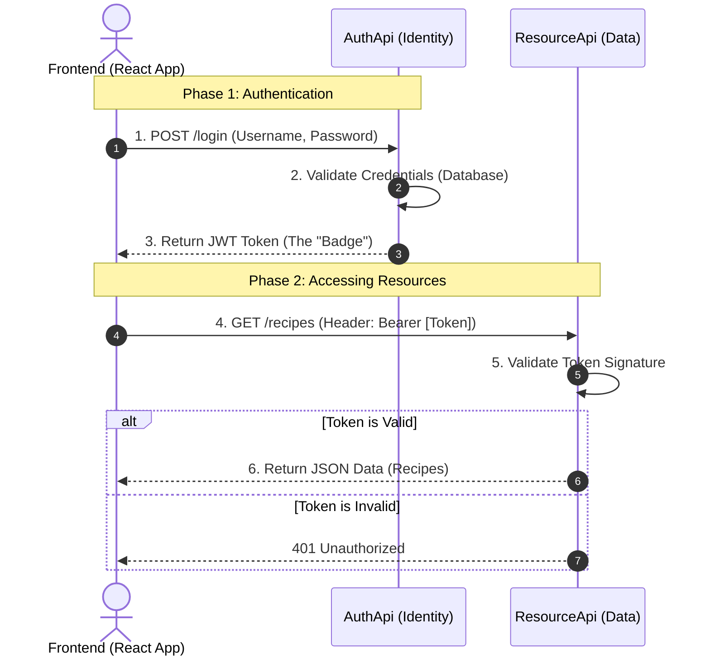

# Student Training Manual: Building a Secure Web API System

This manual guides you through building a complete authentication and resource system using **ASP.NET Core (Web API)**, **Entity Framework Core (SQLite)**, and **JWT (JSON Web Tokens)**.

---

## 1. Project Overview & Architecture

We are building a **Microservices-style** architecture where Authentication is separated from Data Resources.

### **The Big Picture**

*   **Users** (Frontend) need to log in.
*   **AuthApi** checks their password and gives them a "Badge" (JWT Token).
*   **ResourceApi** guards the data (Recipes). It only lets people in if they show a valid Badge.

#### **Architecture Sequence Diagram**


---

## 2. Tools & Prerequisites

*   **.NET SDK**: Version 8, 9, or 10. (Run `dotnet --version` to check).
*   **Editor**: Visual Studio Code (VS Code) or Visual Studio.
*   **API Client**: Postman or ThunderClient (VS Code Extension).

---

## 3. General Concepts

### **Models vs Data (DTOs vs Entities)**
*   **Models (DTOs)**: Public facing data (JSON). The "Menu".
*   **Data (Entities)**: Internal Database storage. The "Inventory".
*   **Mapping**: Converting Data -> Models to show the user.

### **NuGet Packages**
*   Like `npm` for Node.js. Used to install libraries (e.g., `Microsoft.EntityFrameworkCore`).
*   **Rule**: Match your package version (8.x, 9.x) to your .NET SDK version.

---

## 4. Part 1: The Authentication Service (`AuthApi`)
*Focus: Logging in and generating tokens.*

### **Step 1: Create the Project**
Run these commands in your terminal:
```bash
dotnet new webapi -n AuthApi
cd AuthApi
```

### **Step 2: Install Libraries**
We need tools for Identity (Users), Database (SQLite), and JWT.
```bash
dotnet add package Microsoft.AspNetCore.Authentication.JwtBearer
dotnet add package Microsoft.AspNetCore.Identity.EntityFrameworkCore
dotnet add package Microsoft.EntityFrameworkCore.Sqlite
dotnet add package Microsoft.EntityFrameworkCore.Design
```

### **Step 3: Define the Database Context**
**File**: `Data/ApplicationDbContext.cs`

*   **Explanation**: This class manages the connection to the SQLite database. It inherits from `IdentityDbContext` so it automatically supports Users, Roles, and Logins.
*   **Key Snippet**:
    ```csharp
    // Inherits from IdentityDbContext to give us User tables automatically
    public class ApplicationDbContext(DbContextOptions<ApplicationDbContext> options) 
        : IdentityDbContext<IdentityUser>(options) 
    ```
*   **Complete Code**:
    <details>
    <summary>Click to view full code</summary>

    ```csharp
    using Microsoft.AspNetCore.Identity;
    using Microsoft.AspNetCore.Identity.EntityFrameworkCore;
    using Microsoft.EntityFrameworkCore;

    namespace AuthApi.Data;

    public class ApplicationDbContext(DbContextOptions<ApplicationDbContext> options) 
        : IdentityDbContext<IdentityUser>(options)
    {
    }
    ```
    </details>

### **Step 4: Configure Settings**
**File**: `appsettings.json`

*   **Explanation**: Stores configuration variables like Connection Strings and Secret Keys.
*   **Key Snippet**:
    ```json
    "ConnectionStrings": { "DefaultConnection": "Data Source=app.db" },
    "JwtSettings": { "Key": "super-secret-key..." }
    ```
*   **Complete Code**:
    <details>
    <summary>Click to view full code</summary>

    ```json
    {
      "Logging": {
        "LogLevel": {
          "Default": "Information",
          "Microsoft.AspNetCore": "Warning"
        }
      },
      "AllowedHosts": "*",
      "ConnectionStrings": {
        "DefaultConnection": "Data Source=app.db"
      },
      "JwtSettings": {
        "Key": "super-secret-key-that-should-be-stored-securely-and-is-long-enough-for-hs512",
        "Issuer": "http://localhost:5000",
        "Audience": "http://localhost:5000"
      }
    }
    ```
    </details>

### **Step 5: Create Registration/Login Logic**
**File**: `Controllers/AuthController.cs`

*   **Explanation**: Accepts HTTP Requests. It uses `UserManager` to create users and check passwords, then generates a JWT if successful.
*   **Key Snippet**:
    ```csharp
    // Validate User
    var user = await userManager.FindByNameAsync(request.UserName);
    if (user is null || !await userManager.CheckPasswordAsync(user, request.Password)) 
        return Unauthorized();
        
    // Generate Token
    var token = CreateToken(user);
    return Ok(new { Token = token });
    ```
*   **Complete Code**:
    <details>
    <summary>Click to view full code</summary>

    ```csharp
    using Microsoft.AspNetCore.Identity;
    using Microsoft.AspNetCore.Mvc;
    using Microsoft.IdentityModel.Tokens;
    using System.IdentityModel.Tokens.Jwt;
    using System.Security.Claims;
    using System.Text;
    using AuthApi.Models; // Ensure you have an AuthRequest model defined

    namespace AuthApi.Controllers;

    [Route("api/[controller]")]
    [ApiController]
    public class AuthController(UserManager<IdentityUser> userManager, IConfiguration configuration) : ControllerBase
    {
        [HttpPost("register")]
        public async Task<IActionResult> Register(AuthRequest request)
        {
            var user = new IdentityUser { UserName = request.UserName, Email = request.UserName };
            var result = await userManager.CreateAsync(user, request.Password);

            if (result.Succeeded) return Ok(new { Message = "User registered successfully" });
            return BadRequest(result.Errors);
        }

        [HttpPost("login")]
        public async Task<IActionResult> Login(AuthRequest request)
        {
            var user = await userManager.FindByNameAsync(request.UserName);
            if (user is null || !await userManager.CheckPasswordAsync(user, request.Password))
                return Unauthorized("Invalid credentials");

            var token = CreateToken(user);
            return Ok(new { Token = token });
        }

        private string CreateToken(IdentityUser user)
        {
            var claims = new List<Claim>
            {
                new Claim(ClaimTypes.Name, user.UserName!),
                new Claim(ClaimTypes.NameIdentifier, user.Id),
            };

            var key = new SymmetricSecurityKey(Encoding.UTF8.GetBytes(configuration["JwtSettings:Key"]!));
            var creds = new SigningCredentials(key, SecurityAlgorithms.HmacSha512Signature);

            var token = new JwtSecurityToken(
                claims: claims,
                expires: DateTime.Now.AddDays(1),
                signingCredentials: creds
            );

            return new JwtSecurityTokenHandler().WriteToken(token);
        }
    }
    ```
    </details>

### **Step 6: Wire Everything Up (Startup)**
**File**: `Program.cs`

*   **Explanation**: Registers all services (Identity, DB, JWT) and starts the app. Using `EnsureCreated()` makes sure the DB exists.
*   **Key Snippet**:
    ```csharp
    // Add Identity (User Login System)
    builder.Services.AddIdentityCore<IdentityUser>()
        .AddEntityFrameworkStores<ApplicationDbContext>();
        
    // Add JWT Authentication
    builder.Services.AddAuthentication(JwtBearerDefaults.AuthenticationScheme)
        .AddJwtBearer(...)
    ```
*   **Complete Code**:
    <details>
    <summary>Click to view full code</summary>

    ```csharp
    using AuthApi.Data;
    using Microsoft.AspNetCore.Authentication.JwtBearer;
    using Microsoft.AspNetCore.Identity;
    using Microsoft.EntityFrameworkCore;
    using Microsoft.IdentityModel.Tokens;
    using System.Text;

    var builder = WebApplication.CreateBuilder(args);

    builder.Services.AddControllers();
    builder.Services.AddCors(options => options.AddPolicy("AllowAll", p => p.AllowAnyOrigin().AllowAnyMethod().AllowAnyHeader()));

    // 1. Database
    builder.Services.AddDbContext<ApplicationDbContext>(options =>
        options.UseSqlite(builder.Configuration.GetConnectionString("DefaultConnection")));

    // 2. Identity
    builder.Services.AddIdentityCore<IdentityUser>()
        .AddEntityFrameworkStores<ApplicationDbContext>();

    // 3. JWT Authentication
    builder.Services.AddAuthentication(JwtBearerDefaults.AuthenticationScheme)
        .AddJwtBearer(options =>
        {
            options.TokenValidationParameters = new TokenValidationParameters
            {
                ValidateIssuerSigningKey = true,
                IssuerSigningKey = new SymmetricSecurityKey(Encoding.UTF8
                    .GetBytes(builder.Configuration["JwtSettings:Key"]!)),
                ValidateIssuer = false,
                ValidateAudience = false
            };
        });

    var app = builder.Build();

    // 4. Create DB on Start
    using (var scope = app.Services.CreateScope())
    {
        var context = scope.ServiceProvider.GetRequiredService<ApplicationDbContext>();
        context.Database.EnsureCreated();
    }

    app.UseHttpsRedirection();
    app.UseCors("AllowAll");
    app.UseAuthentication();
    app.UseAuthorization();
    app.MapControllers();
    app.Run();
    ```
    </details>

---

## 5. Part 2: The Resource Service (`ResourceApi`)
*Focus: Serving Data (Recipes) to authenticated users.*

### **Step 1: Create the Project**
Go back to the root folder first.
```bash
cd ..
dotnet new webapi -n ResourceApi
cd ResourceApi
```

### **Step 2: Install Libraries**
We need JWT validation and Entity Framework Core.
```bash
dotnet add package Microsoft.AspNetCore.Authentication.JwtBearer
dotnet add package Microsoft.EntityFrameworkCore.Sqlite
dotnet add package Microsoft.EntityFrameworkCore.Design
```

### **Step 3: Define Data vs Model (Strict Separation)**
**1. The Entity (Data)**: `Data/Recipe.cs`
*   **Explanation**: Represents the raw database row. It has private comments and raw ingredient strings.
*   **Complete Code**:
    <details>
    <summary>Click to view full code</summary>

    ```csharp
    using System.ComponentModel.DataAnnotations;
    namespace ResourceApi.Data;
    public class Recipe
    {
        [Key] public int Id { get; set; }
        public string Title { get; set; } = string.Empty;
        public string InternalComments { get; set; } = string.Empty; // Secret!
        public string RawIngredients { get; set; } = string.Empty; // stored as "Chicken,1,kg|..."
        public string Instruction { get; set; } = string.Empty;
    }
    ```
    </details>

**2. The DTO (Model)**: `Models/RecipeDto.cs`
*   **Explanation**: Represents the pretty JSON we send to the Frontend (React). Handles instructions and formatted ingredients.
*   **Complete Code**:
    <details>
    <summary>Click to view full code</summary>

    ```csharp
    namespace ResourceApi.Models;
    public class RecipeDto
    {
        public string Title { get; set; } = string.Empty;
        public List<IngredientDto> Ingredients { get; set; } = new();
        public string Instructions { get; set; } = string.Empty;
    }
    public class IngredientDto
    {
        public string Item { get; set; } = string.Empty;
        public string Quantity { get; set; } = string.Empty;
        public string Uom { get; set; } = string.Empty;
    }
    ```
    </details>

### **Step 4: The Database Context**
**File**: `Data/ResourceDbContext.cs`

*   **Explanation**: Manages the `Recipe` table. We use `HasData` to seed an initial recipe so the DB isn't empty.
*   **Key Snippet**:
    ```csharp
    // Seeding data
    modelBuilder.Entity<Recipe>().HasData(
        new Recipe { Id = 1, Title = "Chicken Adobo", ... }
    );
    ```
*   **Complete Code**:
    <details>
    <summary>Click to view full code</summary>

    ```csharp
    using Microsoft.EntityFrameworkCore;
    namespace ResourceApi.Data;
    public class ResourceDbContext(DbContextOptions<ResourceDbContext> options) : DbContext(options)
    {
        public DbSet<Recipe> Recipes { get; set; } = default!;
        protected override void OnModelCreating(ModelBuilder modelBuilder)
        {
            base.OnModelCreating(modelBuilder);
            modelBuilder.Entity<Recipe>().HasData(new Recipe
            {
                Id = 1, Title = "Chicken Adobo",
                InternalComments = "Grandma's secret",
                RawIngredients = "Chicken,1,kg|Soy Sauce,0.5,cup",
                Instruction = "Combine and simmer."
            });
        }
    }
    ```
    </details>

### **Step 5: The Controller**
**File**: `Controllers/RecipesController.cs`

*   **Explanation**: Fetches Entities from DB, converts them to DTOs, and returns them. It uses `[Authorize]` to ensure only valid Tokens can access it.
*   **Key Snippet**:
    ```csharp
    // Parsing Logic
    Ingredients = entity.RawIngredients.Split('|').Select(i => { ... })
    ```
*   **Complete Code**:
    <details>
    <summary>Click to view full code</summary>

    ```csharp
    using Microsoft.AspNetCore.Authorization;
    using Microsoft.AspNetCore.Mvc;
    using Microsoft.EntityFrameworkCore;
    using ResourceApi.Data;
    using ResourceApi.Models;

    namespace ResourceApi.Controllers;

    [ApiController] [Route("api/[controller]")] [Authorize]
    public class RecipesController(ResourceDbContext context) : ControllerBase
    {
        [HttpGet]
        public async Task<IActionResult> Get()
        {
            var entities = await context.Recipes.ToListAsync();
            var dtos = entities.Select(e => new RecipeDto
            {
                Title = e.Title,
                Instructions = e.Instruction,
                Ingredients = e.RawIngredients.Split('|').Select(i => 
                {
                    var p = i.Split(',');
                    return new IngredientDto { Item = p[0], Quantity = p[1], Uom = p.Length > 2 ? p[2] : "unit" };
                }).ToList()
            });
            return Ok(dtos);
        }
    }
    ```
    </details>

### **Step 6: Configuration (Program.cs & appsettings)**
*   **Important**: Copy the `JwtSettings` block from `AuthApi`'s `appsettings.json` to `ResourceApi`'s `appsettings.json` exactly! The keys **MUST** match.
*   **Program.cs**: Register DbContext and JwtBearer (same as AuthApi, but no Identity).
*   **Complete Code (Program.cs)**:
    <details>
    <summary>Click to view full code</summary>

    ```csharp
    using Microsoft.AspNetCore.Authentication.JwtBearer;
    using Microsoft.EntityFrameworkCore;
    using Microsoft.IdentityModel.Tokens;
    using System.Text;

    var builder = WebApplication.CreateBuilder(args);
    builder.Services.AddControllers();
    builder.Services.AddCors(o => o.AddPolicy("AllowAll", p => p.AllowAnyOrigin().AllowAnyMethod().AllowAnyHeader()));

    builder.Services.AddDbContext<ResourceApi.Data.ResourceDbContext>(o => 
        o.UseSqlite(builder.Configuration.GetConnectionString("DefaultConnection")));

    builder.Services.AddAuthentication(JwtBearerDefaults.AuthenticationScheme)
        .AddJwtBearer(o => {
            o.TokenValidationParameters = new TokenValidationParameters {
                ValidateIssuerSigningKey = true,
                IssuerSigningKey = new SymmetricSecurityKey(Encoding.UTF8.GetBytes(builder.Configuration["JwtSettings:Key"]!)),
                ValidateIssuer = false, ValidateAudience = false
            };
        });

    var app = builder.Build();
    using (var scope = app.Services.CreateScope()) {
        scope.ServiceProvider.GetRequiredService<ResourceApi.Data.ResourceDbContext>().Database.EnsureCreated();
    }

    app.UseCors("AllowAll");
    app.UseAuthentication();
    app.UseAuthorization();
    app.MapControllers();
    app.Run();
    ```
    </details>

---

## 6. Part 3: The Solution (`SampleWebApi.sln`)
*Focus: Grouping everything together for easy management.*

### **Why use a Solution?**
A Solution (`.sln`) is a container that holds multiple projects. It allows you to open both `AuthApi` and `ResourceApi` in a single Visual Studio window and build them together.

### **Step 1: Create the Solution**
Go to the root folder (where both api folders are located).
```bash
dotnet new sln -n SampleWebApi
```

### **Step 2: Add Projects to Solution**
```bash
dotnet sln add AuthApi/AuthApi.csproj
dotnet sln add ResourceApi/ResourceApi.csproj
```

> [!TIP]
> **Pro Tip**: Now you can just open `SampleWebApi.sln` in Visual Studio, or the root folder in VS Code, and you will see both projects organized neatly.

---

## 7. Testing Your System (No Swagger)
Since we are minimal, we use Postman or ThunderClient.

1.  **Start AuthApi**: `dotnet run` (in AuthApi folder).
2.  **Start ResourceApi**: `dotnet run` (in ResourceApi folder).
3.  **Register/Login**: POST to `http://localhost:5xxx/api/auth/register` then `/login`.
4.  **Get Token**: Copy the token string.
5.  **Get Recipes**: GET `http://localhost:5xxx/api/recipes`.
    *   **Auth Tab**: Select "Bearer Token". Paste the token.
    *   **Send**: You should see your JSON recipes!
