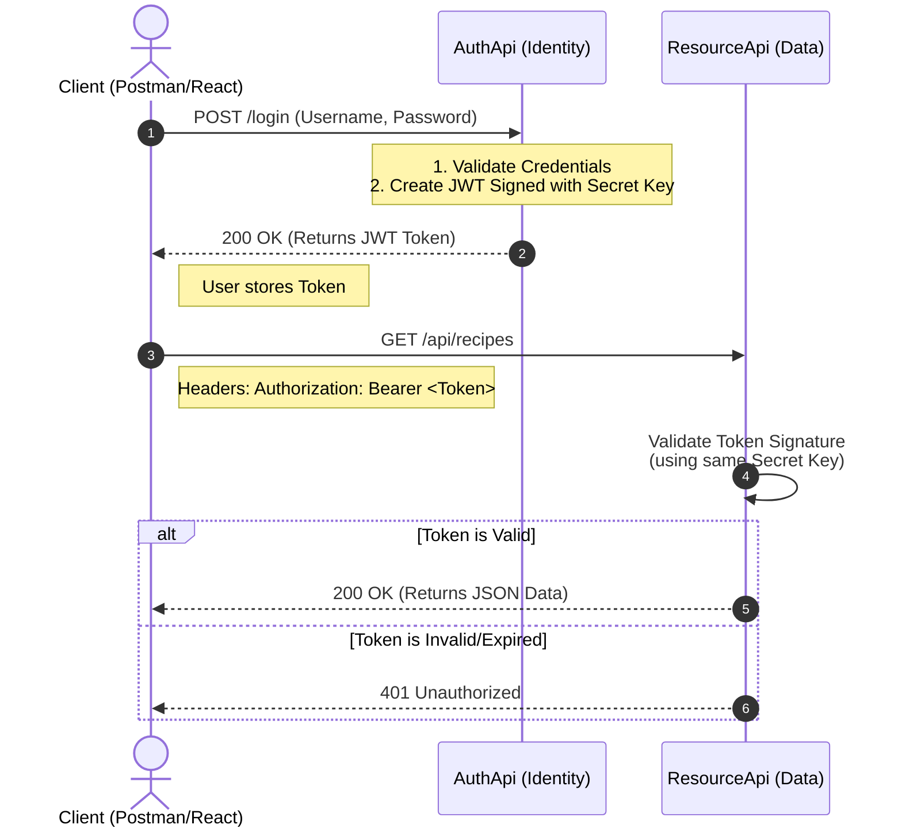

# Student Manual & Cheat Sheet: AuthApi & ResourceApi

This manual covers the structure, architecture, and critical components of the `AuthApi` and `ResourceApi` projects. It serves as a study guide for understanding Authentication, Authorization, Dependency Injection, and modern ASP.NET Core Architecture.

---

## 1. Project Overview & Architecture

This solution consists of two distinct Web API projects that work together to demonstrate a secure **Microservices-style** authentication flow.

### **1.1 The Two Projects**

1.  **AuthApi (The Authority)**:
    *   **Role**: Responsible for **Authentication** (identifying who the user is).
    *   **Function**: Users send credentials (username/password) here. If valid, it issues a **JWT** (JSON Web Token).
    *   **Key Components**: ASP.NET Core Identity, Entity Framework Core, JWT Token Generation.

2.  **ResourceApi (The Resource Server)**:
    *   **Role**: Responsible for **Authorization** (guarding data).
    *   **Function**: Holds the data (e.g., Recipes). It demands a valid JWT to access its endpoints. It trusts the token issued by `AuthApi`.
    *   **Key Components**: JWT Bearer Authentication, `[Authorize]` attribute.

### **1.2 Why Separate Projects? (Real-World Scenario)**

In a simple monolithic application, Auth and Data often live together. However, separating them mirrors modern **Enterprise/Microservices Architecture**:

1.  **Centralized Security (SSO)**:
    *   Think of Google. You have one account (Google Auth) that works for Gmail, YouTube, Drive, and Maps.
    *   In our setup, `AuthApi` is "Google Account", and `ResourceApi` is "Gmail". You could easily add a `PaymentsApi`, `ProfileApi`, or `ChatApi` that all trust the *same* `AuthApi` without re-implementing login logic 10 times.

2.  **Security Isolation**:
    *   The database holding User Passwords (`AuthApi`) is physically separate from the database holding Business Data (`ResourceApi`).
    *   If the `ResourceApi` is compromised, common attackers cannot easily steal user credentials because they are stored elsewhere.

3.  **Independent Scalability**:
    *   Authentication is "bursty" (everyone logs in at 9 AM). Resource usage might be consistent all day. You can run 5 servers for `AuthApi` and 2 for `ResourceApi` depending on load.

### **1.3 The Authentication Flow Diagram**

The following diagram illustrates how the client (User/Browser), the Auth Server, and the Resource Server interact.



**Step-by-Step Flow:**
1.  **Login**: User sends credentials to `AuthApi`.
2.  **Token Issuance**: `AuthApi` verifies user, signs a JSON object (JWT) with a private **Secret Key**, and gives it to the User.
3.  **Request**: User wants data from `ResourceApi`. They send the request *attached with the Token* (like showing an ID badge).
4.  **Verification**: `ResourceApi` has the *same* **Secret Key**. It receives the token, checks the signature. If the signature matches, it knows `AuthApi` issued it.
5.  **Response**: `ResourceApi` serves the data.

---

## 2. Prerequisites

To run and understand these projects, you need:
*   **.NET SDK**: (Version 6, 7, 8, or 9 depending on installation).
*   **IDE**: Visual Studio, VS Code, or Rider.
*   **Database Tool** (Optional but recommended): DB Browser for SQLite (since we use SQLite).
*   **API Client**: Postman or ThunderClient (to test endpoints).

---

## 3. Step-by-Step Creation Guide

Follow these steps to recreate the solution from scratch.

### **Phase 1: Setup Solution & Projects**
1.  **Create a blank solution** (Optional, keeps things organized):
    ```bash
    dotnet new sln -n SampleWebAuth
    ```
2.  **Create the AuthApi project**:
    ```bash
    dotnet new webapi -n AuthApi
    dotnet sln add AuthApi/AuthApi.csproj
    ```
3.  **Create the ResourceApi project**:
    ```bash
    dotnet new webapi -n ResourceApi
    dotnet sln add ResourceApi/ResourceApi.csproj
    ```

### **Phase 2: AuthApi Configuration**
*Run these commands inside the `AuthApi` folder.*

1.  **Install NuGet Packages**:
    These packages allow us to use SQLite, Identity, and JWTs.
    ```bash
    dotnet add package Microsoft.AspNetCore.Authentication.JwtBearer
    dotnet add package Microsoft.AspNetCore.Identity.EntityFrameworkCore
    dotnet add package Microsoft.EntityFrameworkCore.Sqlite
    dotnet add package Microsoft.EntityFrameworkCore.Design
    ```

2.  **Clean up Scaffolding**:
    *   Delete `WeatherForecast.cs` and `Controllers/WeatherForecastController.cs`.

3.  **Create Folder Structure**:
    *   Create folders: `Models`, `Data`, `Controllers` (already exists).

4.  **Create Files**:
    *   Create access classes: `Models/AuthRequest.cs` (See Section 5).
    *   Create DB Context: `Data/ApplicationDbContext.cs` (See Section 5).
    *   Create Controller: `Controllers/AuthController.cs` (See Section 5).
    *   Update Config: `appsettings.json` (See Section 5).
    *   Update Entry Point: `Program.cs` (See Section 5).

### **Phase 3: ResourceApi Configuration**
*Run these commands inside the `ResourceApi` folder.*

1.  **Install NuGet Packages**:
    We need JWT validation AND Entity Framework Core for SQLite.
    ```bash
    dotnet add package Microsoft.AspNetCore.Authentication.JwtBearer
    dotnet add package Microsoft.EntityFrameworkCore.Sqlite
    dotnet add package Microsoft.EntityFrameworkCore.Design
    ```

2.  **Clean up Scaffolding**:
    *   Delete `WeatherForecast.cs` and `Controllers/WeatherForecastController.cs`.

3.  **Create Folder Structure**:
    *   Create folders: `Models`, `Data`, `Controllers` (already exists).

4.  **Create Files**:
    *   Create Entity: `Data/Recipe.cs` (See Section 6).
    *   Create DB Context: `Data/ResourceDbContext.cs` (See Section 6).
    *   Create DTO: `Models/RecipeDto.cs` (See Section 6).
    *   Create Controller: `Controllers/RecipesController.cs` (See Section 6).
    *   Update Config: `appsettings.json` (See Section 6).
    *   Update Entry Point: `Program.cs` (See Section 6).


### **Models vs Data (DTOs vs Entities)**
*   **Models (DTOs)**: public facing data. This is what we send to the user (JSON). It might look nice, be simplified, or hide sensitive info.
    *   *Analogy*: The menu in a restaurant (describes the food nicely).
*   **Data (Entities)**: Database representation. This matches the SQL table structure. It might be ugly, raw, or contain secrets.
    *   *Analogy*: The raw ingredients list in the kitchen inventory.
*   **Mapping**: The process of converting Data -> Model before sending a response.

### **What are NuGet Packages?**
NuGet is the package manager for .NET (like `npm` for Node.js or `pip` for Python).
*   It allows us to download code written by Microsoft or others (e.g., `Microsoft.EntityFrameworkCore`) so we don't have to write everything from scratch.
*   We use `dotnet add package <name>` to install them.
*   **Version Matching Rule**:
    *   If you are using **.NET 8**, you should install **version 8.x.x** of the packages.
    *   If you are using **.NET 9**, use **version 9.x.x**.
    *   *Why?* The tools generally need to speak the same "language" version. Mixing a .NET 9 framework with a .NET 6 library *might* work, but mixing a .NET 6 framework with a .NET 9 library will definitely crash.

### **.NET Versions (8, 9, 10)**
This guide works for .NET 8, 9, or the upcoming 10.
*   **Recommendation**: Always use the latest installed SDK for new projects.
*   **Check Version**: Run `dotnet --version` in your terminal to see what you have.

### **Navigating without Swagger (OpenAPI)**
Some newer or older templates might not have Swagger enabled by default (especially in .NET 8/9 minimal configurations or if explicitly removed).
1.  **Check `Properties/launchSettings.json`**: Look for `applicationUrl` (e.g., `http://localhost:5248`).
2.  **Know your Endpoint**: If your controller has `[Route("api/[controller]")]` and the class is `RecipesController`, your URL is `/api/recipes`.
3.  **Test manually**: Use **Postman** or **ThunderClient**.
    *   METHOD: `GET`
    *   URL: `http://localhost:5248/api/recipes`

---

## 4. General Concepts

### **Dependency Injection (DI) & Startup Logic**
ASP.NET Core uses **Dependency Injection (DI)** heavily. DI is a technique where objects ("services") are provided to a class rather than the class creating them itself.
*   **In `Program.cs`**: We "register" services into a container (the `builder.Services`).
*   **In Classes (e.g., Controllers)**: We request these services via the constructor. The framework automatically provides them.

### **App vs Builder (in `Program.cs`)**
*   **`builder` (`WebApplicationBuilder`)**: This is the construction phase. You use it to **configure** services, settings, and logging *before* the app starts.
    *   *Usage*: `builder.Services.AddControllers();`
*   **`app` (`WebApplication`)**: This is the running application. You use it to define the **Request Pipeline** (Middleware) — how the app handles partial HTTP requests.
    *   *Usage*: `app.UseAuthentication();`, `app.MapControllers();`

### **ORM (Object-Relational Mapper)**
An ORM allows you to interact with a database using C# objects instead of writing raw SQL code.
*   **EF Core (Entity Framework Core)** is the ORM used here.
*   It maps a C# Class (like `IdentityUser`) to a Database Table (like `AspNetUsers`).

### **Identity (EF Core)**
**ASP.NET Core Identity** is a complete membership system. It handles:
*   User storage (Users, Roles).
*   Password hashing (security).
*   Validation (User existing, password strength).
*   In this project, it is linked with EF Core to store users in an SQLite database.

### **JWT (JSON Web Token)**
A JWT is a secure, URL-safe way to represent claims (facts) about a user.
*   **Header**: Algorithm used.
*   **Payload**: User data (ID, Name, Expiration).
*   **Signature**: A cryptographic proof signed with a Secret Key to ensure the token hasn't been tampered with.

### **CORS (Cross-Origin Resource Sharing)**
Browsers block web pages from making API requests to a different domain by default.
*   **CORS** is a mechanism that allows a server (our API) to say, "I allow this website (e.g., localhost:3000) to call me."
*   In our code, we use `AllowAll` for simplicity in development.

---

## 5. AuthApi Project Deep Dive

### **Scaffold & Files Created**

1.  **`Program.cs`**: The entry point. Configures services and middleware.
2.  **`Data/ApplicationDbContext.cs`**: The bridge between our code and the database.
3.  **`Controllers/AuthController.cs`**: Handles Login and Register logic.
4.  **`appsettings.json`**: Stores configuration (DB Connection String, Secret Key).
5.  **`Models/AuthRequest.cs`**: A simple class to hold Login/Register data.

### **Critical Code Definitions**

#### **`appsettings.json`**
Defines the Database Location and the Secret Key for signing tokens.
> **Important**: The `JwtSettings:Key` must be at least 32 characters long!

```json
{
  "Logging": {
    "LogLevel": {
      "Default": "Information",
      "Microsoft.AspNetCore": "Warning"
    }
  },
  "AllowedHosts": "*",
  "ConnectionStrings": {
    "DefaultConnection": "Data Source=app.db"
  },
  "JwtSettings": {
    "Key": "super-secret-key-that-should-be-stored-securely-and-is-long-enough-for-hs512",
    "Issuer": "http://localhost:5248",
    "Audience": "http://localhost:5248"
  }
}
```

#### **`Models/AuthRequest.cs`**
Standard DTO (Data Transfer Object) for receiving user input.

```csharp
using System.ComponentModel.DataAnnotations;

namespace AuthApi.Models;

public class AuthRequest
{
    [Required]
    public string Username { get; set; } = string.Empty;

    [Required]
    public string Password { get; set; } = string.Empty;
}
```

#### **`Program.cs` (AuthApi)**
This file sets up the DB, Identity, and JWT generation.

```csharp
using Microsoft.AspNetCore.Authentication.JwtBearer;
using Microsoft.EntityFrameworkCore;
using Microsoft.IdentityModel.Tokens;
using AuthApi.Data;

using System.Text;

var builder = WebApplication.CreateBuilder(args);

// Add services to the container.

builder.Services.AddControllers();
// CORS: Allows any website to call this API
builder.Services.AddCors(options => options.AddPolicy("AllowAll", policy => policy.AllowAnyOrigin().AllowAnyMethod().AllowAnyHeader()));

// DB Connection: Registers the DB Context using SQLite
builder.Services.AddDbContext<AuthApi.Data.ApplicationDbContext>(options =>
    options.UseSqlite(builder.Configuration.GetConnectionString("DefaultConnection")));

// Identity: Adds User management (Sign up, Login logic) linked to EF Core
builder.Services.AddIdentityCore<Microsoft.AspNetCore.Identity.IdentityUser>()
    .AddEntityFrameworkStores<AuthApi.Data.ApplicationDbContext>();

// Authentication: Configures the app to know HOW to validate JWTs (even though it issues them, it's good practice)
builder.Services.AddAuthentication(JwtBearerDefaults.AuthenticationScheme)
    .AddJwtBearer(options =>
    {
        options.TokenValidationParameters = new TokenValidationParameters
        {
            ValidateIssuerSigningKey = true,
            IssuerSigningKey = new SymmetricSecurityKey(Encoding.UTF8
                .GetBytes(builder.Configuration.GetSection("JwtSettings:Key").Value!)),
            ValidateIssuer = false,
            ValidateAudience = false
        };
    });

// OpenAPI (Swagger) to document endpoints
builder.Services.AddOpenApi();

var app = builder.Build();

// SEEDING DATA: Automatically creates a default user "student@example.com" if not exists
using (var scope = app.Services.CreateScope())
{
    var context = scope.ServiceProvider.GetRequiredService<AuthApi.Data.ApplicationDbContext>();
    context.Database.EnsureCreated();

    var userManager = scope.ServiceProvider.GetRequiredService<Microsoft.AspNetCore.Identity.UserManager<Microsoft.AspNetCore.Identity.IdentityUser>>();
    if (await userManager.FindByNameAsync("student@example.com") == null)
    {
        var user = new Microsoft.AspNetCore.Identity.IdentityUser
        {
            UserName = "student@example.com",
            Email = "student@example.com"
        };
        await userManager.CreateAsync(user, "P@ssw0rd!");
    }
}

// Configure the HTTP request pipeline.
if (app.Environment.IsDevelopment())
{
    app.MapOpenApi();
}

app.UseHttpsRedirection();

app.UseCors("AllowAll");

app.UseAuthentication();
app.UseAuthorization();

app.MapControllers();

app.Run();
```

#### **`Data/ApplicationDbContext.cs`**
Inherits from `IdentityDbContext` to automatically include tables for Users, Roles, etc.

```csharp
using Microsoft.AspNetCore.Identity;
using Microsoft.AspNetCore.Identity.EntityFrameworkCore;
using Microsoft.EntityFrameworkCore;
using AuthApi.Models;

namespace AuthApi.Data;

public class ApplicationDbContext : IdentityDbContext<IdentityUser>
{
    public ApplicationDbContext(DbContextOptions<ApplicationDbContext> options) : base(options)
    {
    }
}
```

> **💡 Pro Tip: Alternative Seeding with `HasData`**
>
> While we used `Program.cs` to seed data (which is easy for beginners to understand), a more robust "Code-First" approach is to seed data directly in the `ApplicationDbContext` using the `OnModelCreating` method.
>
> This requires manually hashing the password but keeps data definition within the database context.
>
> **Example `ApplicationDbContext.cs` update:**
> ```csharp
> protected override void OnModelCreating(ModelBuilder builder)
> {
>     base.OnModelCreating(builder);
>
>     var hasher = new PasswordHasher<IdentityUser>();
>     var user = new IdentityUser
>     {
>         Id = "8e445865-a24d-4543-a6c6-9443d048cdb9",
>         UserName = "student@example.com",
>         NormalizedUserName = "STUDENT@EXAMPLE.COM",
>         Email = "student@example.com",
>         NormalizedEmail = "STUDENT@EXAMPLE.COM",
>         EmailConfirmed = true,
>         SecurityStamp = Guid.NewGuid().ToString()
>     };
>     user.PasswordHash = hasher.HashPassword(user, "P@ssw0rd!");
>
>     builder.Entity<IdentityUser>().HasData(user);
> }
> ```

#### **`Controllers/AuthController.cs`**
Handles logic. Notice **Injection** in the constructor (`UserManager`, `IConfiguration`).

```csharp
using System.IdentityModel.Tokens.Jwt;
using System.Security.Claims;
using System.Text;
using Microsoft.AspNetCore.Identity;
using Microsoft.AspNetCore.Mvc;
using Microsoft.IdentityModel.Tokens;
using AuthApi.Models;

namespace AuthApi.Controllers;

[Route("api/[controller]")]
[ApiController]
public class AuthController(UserManager<IdentityUser> userManager, IConfiguration configuration) : ControllerBase
{
    [HttpPost("register")]
    public async Task<IActionResult> Register(AuthRequest request)
    {
        var user = new IdentityUser { UserName = request.Username, Email = request.Username };
        var result = await userManager.CreateAsync(user, request.Password);

        if (result.Succeeded)
        {
            return Ok(new { user.Id, user.UserName });
        }

        return BadRequest(result.Errors);
    }

    [HttpPost("login")]
    public async Task<IActionResult> Login(AuthRequest request)
    {
        var user = await userManager.FindByNameAsync(request.Username);
        if (user == null)
        {
            return BadRequest("User not found.");
        }

        if (!await userManager.CheckPasswordAsync(user, request.Password))
        {
            return BadRequest("Wrong password.");
        }

        string token = CreateToken(user);
        return Ok(new { token = token });
    }

    private string CreateToken(IdentityUser user)
    {
        // 1. Create Claims (Details about the user embedded in token)
        List<Claim> claims = new List<Claim>
        {
            new Claim(ClaimTypes.Name, user.UserName!),
            new Claim(ClaimTypes.NameIdentifier, user.Id)
        };

        // 2. Encryption Key (must match ResourceApi)
        var key = new SymmetricSecurityKey(Encoding.UTF8.GetBytes(
            configuration.GetSection("JwtSettings:Key").Value!));

        var creds = new SigningCredentials(key, SecurityAlgorithms.HmacSha512Signature);

        // 3. Create Token Object
        var token = new JwtSecurityToken(
            claims: claims,
            expires: DateTime.Now.AddDays(1),
            signingCredentials: creds
        );

        // 4. Write Token as String
        var jwt = new JwtSecurityTokenHandler().WriteToken(token);
        return jwt;
    }
}
```

---

## 6. ResourceApi Project Deep Dive

### **Scaffold & Files Created**

1.  **`Program.cs`**: Configures Authentication, DB, and Dependency Injection.
2.  **`Controllers/RecipesController.cs`**: Maps Database Entities to DTOs.
3.  **`Data/Recipe.cs`**: The strict database entity.
4.  **`Data/ResourceDbContext.cs`**: The Database Context (EF Core).
5.  **`Models/RecipeDto.cs`**: The public-facing model.
6.  **`appsettings.json`**: Secret Key + Connection String.

### **Critical Code Definitions**

#### **`appsettings.json`**
Adds a Connection String for the Resource DB (`resource.db`).

```json
{
  "Logging": {
    "LogLevel": {
      "Default": "Information",
      "Microsoft.AspNetCore": "Warning"
    }
  },
  "AllowedHosts": "*",
  "ConnectionStrings": {
    "DefaultConnection": "Data Source=resource.db"
  },
  "JwtSettings": {
    "Key": "super-secret-key-that-should-be-stored-securely-and-is-long-enough-for-hs512",
    "Issuer": "http://localhost:5248",
    "Audience": "http://localhost:5248"
  }
}
```

#### **`Data/Recipe.cs` (The Database Entity)**
Matches the database table.
```csharp
using System.ComponentModel.DataAnnotations;

namespace ResourceApi.Data;

public class Recipe
{
    [Key]
    public int Id { get; set; }
    public string Title { get; set; } = string.Empty;
    public string InternalComments { get; set; } = string.Empty; // Private
    public string RawIngredients { get; set; } = string.Empty; // Item,Qty,Uom|...
    public string Instruction { get; set; } = string.Empty;
}
```

#### **`Data/ResourceDbContext.cs`**
Manages the database and seeds initial data.
```csharp
using Microsoft.EntityFrameworkCore;

namespace ResourceApi.Data;

public class ResourceDbContext : DbContext
{
    public ResourceDbContext(DbContextOptions<ResourceDbContext> options) : base(options)
    {
    }

    public DbSet<Recipe> Recipes { get; set; } = default!;

    protected override void OnModelCreating(ModelBuilder modelBuilder)
    {
        base.OnModelCreating(modelBuilder);

        modelBuilder.Entity<Recipe>().HasData(
            new Recipe
            {
                Id = 1,
                Title = "Chicken Adobo",
                InternalComments = "Grandma's secret recipe, do not share with competitors.",
                RawIngredients = "Chicken,1,kg|Soy Sauce,0.5,cup|Vinegar,0.5,cup|Garlic,1,head",
                Instruction = "Combine all ingredients in a pot. Marinate for 30 mins. Simmer until tender."
            }
        );
    }
}
```

#### **`Models/RecipeDto.cs` (The Public Answer)**
The clean JSON response.
```csharp
namespace ResourceApi.Models;

public class RecipeDto
{
    public string Title { get; set; } = string.Empty;
    public List<IngredientDto> Ingredients { get; set; } = new();
    public string Instructions { get; set; } = string.Empty;
}

public class IngredientDto
{
    public string Item { get; set; } = string.Empty;
    public string Quantity { get; set; } = string.Empty;
    public string Uom { get; set; } = string.Empty;
}
```

#### **`Controllers/RecipesController.cs`**
Injects the DB Context and projects data.

```csharp
using Microsoft.AspNetCore.Authorization;
using Microsoft.AspNetCore.Mvc;
using Microsoft.EntityFrameworkCore;
using ResourceApi.Data;
using ResourceApi.Models;

namespace ResourceApi.Controllers;

[ApiController]
[Route("api/[controller]")]
[Authorize]
public class RecipesController(ResourceDbContext context) : ControllerBase
{
    [HttpGet]
    public async Task<IActionResult> Get()
    {
        // 1. Fetch from DB
        var entities = await context.Recipes.ToListAsync();

        // 2. Map Entity -> DTO
        var dtos = entities.Select(entity => new RecipeDto
        {
            Title = entity.Title,
            Instructions = entity.Instruction,
            Ingredients = entity.RawIngredients.Split('|').Select(i => 
            {
                var parts = i.Split(',');
                return new IngredientDto 
                { 
                    Item = parts[0], 
                    Quantity = parts[1],
                    Uom = parts.Length > 2 ? parts[2] : "unit"
                };
            }).ToList()
        });

        return Ok(dtos);
    }
}
```

#### **`Program.cs` (ResourceApi)**
Updated to include Database registration.

```csharp
using Microsoft.AspNetCore.Authentication.JwtBearer;
using Microsoft.EntityFrameworkCore;
using Microsoft.IdentityModel.Tokens;
using System.Text;

var builder = WebApplication.CreateBuilder(args);

// Add services
builder.Services.AddControllers();
builder.Services.AddCors(options => options.AddPolicy("AllowAll", policy => policy.AllowAnyOrigin().AllowAnyMethod().AllowAnyHeader()));

// Register DB Context
builder.Services.AddDbContext<ResourceApi.Data.ResourceDbContext>(options =>
    options.UseSqlite(builder.Configuration.GetConnectionString("DefaultConnection")));

builder.Services.AddAuthentication(JwtBearerDefaults.AuthenticationScheme)
    .AddJwtBearer(options =>
    {
        // ... same JWT validation as before ...
        options.TokenValidationParameters = new TokenValidationParameters
        {
            ValidateIssuerSigningKey = true,
            IssuerSigningKey = new SymmetricSecurityKey(Encoding.UTF8
                .GetBytes(builder.Configuration.GetSection("JwtSettings:Key").Value!)),
            ValidateIssuer = false,
            ValidateAudience = false
        };
    });

var app = builder.Build();

// Create Database on startup
using (var scope = app.Services.CreateScope())
{
    var context = scope.ServiceProvider.GetRequiredService<ResourceApi.Data.ResourceDbContext>();
    context.Database.EnsureCreated();
}

app.UseHttpsRedirection();
app.UseCors("AllowAll");

app.UseAuthentication();
app.UseAuthorization();

app.MapControllers();

app.Run();
```

---

## 7. Architectural Summary

1.  **Framework**: ASP.NET Core Web API (Supporting .NET 8/9/10).
2.  **Pattern**: **RESTful API** (Representational State Transfer).
    *   While we use "Controllers", we are NOT using Views. We return JSON data, which makes this a pure API.
3.  **Security**: **JWT Bearer Authentication** backed by **ASP.NET Core Identity**.
    *   *Clarification*: This is **NOT** full OAuth2/OpenID Connect (which involves redirecting to a login page like 'Login with Google').
    *   This is a custom token-based flow: User sends Password -> Server validates & signs JWT -> User keeps JWT -> User sends JWT for data.
4.  **Database**: **Code-First** approach with **Entity Framework Core**.

This setup represents a modern Microservices-ready architecture where Authentication is decoupled from Resources.
